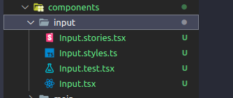

<div align="center">
  <h1 style="color:grey;font-style: italic;">Boilerplate V2.</h1>
  
</div>

#### Description:

The **boilerplate** is a solid and highly configured foundation for starting front-end projects efficiently and consistently. It combines a variety of popular tools and technologies to accelerate development and maintain code quality.

#### Key Technologies:

<div align="center" style="display:flex;gap:20px;align-item:center;justify-content:center; margin:40px 0;width:100%">
  
  
  
  
  
  
</div>

- **[NEXT.JS v13.x](https://nextjs.org/, 'Next.js Website'):** A highly optimized React framework for building efficient server-rendered front-end applications.

- **[STYLED COMPONENTS](https://styled-components.com/, 'Styled-components Website'):** A CSS-in-JS library that allows styling components in an encapsulated and dynamic way.

- **[JEST](https://jestjs.io/, 'Jest Website'):** A JavaScript testing framework that makes it easy to create and run unit and integration tests.

- **[STORYBOOK](https://storybook.js.org/, 'Storybook Website'):** A tool for developing isolated components and documentation, enabling interactive visualization of components.

- **[HUSKY](https://typicode.github.io/husky/, 'Husky Website'):** Used to configure Git pre-commit hooks, ensuring that code is checked and tested before being committed.

- **[ESLINT](https://eslint.org/, 'ESLint Website'):** A JavaScript linter that helps maintain consistent and high-quality code.

- **[PRETTIER](https://prettier.io/, 'Prettier Website'):** An automatic code formatter to maintain consistent formatting throughout the project.

- **[LINT-STAGED](https://github.com/okonet/lint-staged#readme, 'Lint-staged Website'):** Used in conjunction with Husky to run lint checks only on modified files.

- **[PLOP](https://plopjs.com/documentation/#installation, 'Plop Website'):** A code generation tool to automate the creation of repetitive code artifacts such as components, pages, and more.

- **[TYPESCRIPT](https://www.typescriptlang.org/, 'TypeScript Website'):** A popular choice for developers looking to write safer, scalable, and easily maintainable JavaScript code, especially in complex and large-scale projects.

#### How to Clone the Project and Run It on Your Machine

```bash
  git clone https://github.com/mauriciogirardi/boilerplate-v2.git

  cd boilerplate-v2

  npm install

  npm start
```

#### How to start a project using this boilerplate

```bash
  npx create-next-app -e https://github.com/mauriciogirardi/boilerplate-v2
```

#### How to generate components

```bash
  npm run generator

  # What is your component name?: Input
```



</br>

---
[MIT License](LICENSE)

Create with :heart: by **[Mauricio Girardi](https://www.linkedin.com/in/mauricio-girardi/, 'Site do linkedin')**
